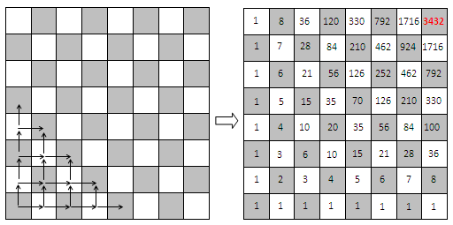

El problema es similar a el caso de la siguiente imagen:

En ambos, se hace un conteo de la cantidad de formas de llegar a una casilla con movimientos no reversibles, esto se puede calcular simplemente como la suma de las formas de llegar a cada uno de los estados anteriores posibles. Es decir, si solo son validos movimientos hacia la derecha y hacia abajo, la cantidad de formas de llegar a una casilla es:

(# Formas de llegar a la casilla que tiene arriba) + (# Formas de llegar a la casilla que tiene a su izquierda)

Tabulando estos valores de arriba a abajo y de izquierda a derecha se puede obtener la cantidad de formas de llegar a cada casilla usando la informacion precalculada.
